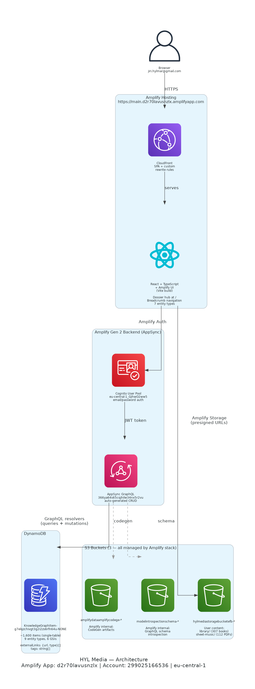

# Architecture Documentation

## Diagram



## Components

| Component | Resource Name | Purpose |
|-----------|---------------|---------|
| Amplify App | `d2r70lavusnzlx` | Hosting, CI/CD from GitHub `main` |
| CloudFront | via Amplify Hosting | SPA delivery with custom rewrite rules |
| Cognito | `eu-central-1_GJhwO2ww5` | Email/password authentication |
| AppSync | `366ya64s65cqjhilw34nx5r2vu` | Auto-generated GraphQL CRUD API |
| DynamoDB | `KnowledgeGraphItem-g7elqzchivgt3g2i2zs6rfn64u-NONE` | Single-table: ~1,600 items, 6 GSIs |

## Data Model (Single-Table Design)

| Entity Type | Count | Description |
|-------------|-------|-------------|
| movie | 94 | Films with language, cast links |
| band | 45 | Music groups |
| person | 416 | Actors, directors, authors, artists, musicians |
| recording | 94 | Songs/tracks with performer links |
| collaboration | 8 | Music collaborations (reuses BandDetail) |
| book | 306 | Library items with author, S3 file reference |
| sheet_music | 112 | Chord sheets with artist, S3 file reference |
| movie_cast | ~400 | Relationship: movie <> person (role) |
| recording_performer | ~160 | Relationship: recording <> person/band |
| sheet_music_performer | ~62 | Relationship: sheet_music <> person/band |

### Key Fields on All Entities

- `externalLinks` — JSON string `Array<{url: string, type: string}>`, flexible external link storage
- `tags` — string array, controlled vocabulary from tag dictionary
- `updatedAt` / `updatedBy` — audit trail

### External Link Sources

| Type | Used For | Coverage |
|------|----------|----------|
| wikipedia | All entity types | Movies 100%, Bands 100%, People 63%, Recordings 73%, Sheets 59% |
| imdb | Movies, People (actors/directors) | Movies 100%, People 47% |
| nkp | Books (Czech National Library) | 100% |
| openlibrary | Books (international) | 20% |
| musicbrainz | Recordings, Sheet Music | Recordings 90%, Sheets 85% |
| supermusic | Recordings, Sheet Music | Recordings 97%, Sheets 100% |

Total: 908/1,067 items have at least one external link (85%).

## S3 Buckets (all managed by Amplify stack)

| Bucket | Type | Contents |
|--------|------|----------|
| `...-hylmediastoragebucketefb-*` | User content | `library/` (307 books), `sheet-music/` (112 PDFs) |
| `...-amplifydataamplifycodege-*` | Amplify internal | CodeGen artifacts |
| `...-modelintrospectionschema-*` | Amplify internal | GraphQL schema introspection |

All 3 buckets are created and managed by the Amplify CloudFormation stack. Do not delete them manually.

## DynamoDB GSIs

| GSI | Partition Key | Sort Key | Purpose |
|-----|---------------|----------|---------|
| byType | entityType | name | List entities by type |
| byCastMovie | movieId | role | Find cast members for a movie |
| byPersonFilm | personId | movieName | Find movies for a person |
| byRecording | recordingId | performerName | Find performers for a recording |
| byPerformer | performerId | recordingName | Find recordings for a performer |
| byLanguage | language | name | Filter by language |

## Frontend — Navigation

The app uses a **Dossier-first** navigation model:

```
/                    Dossier (main hub — 8 tabs: Overview, Movies, Bands, People,
                     Recordings, Library, Sheet Music, Tags)
  /?tab=movies       Deep-link to specific Dossier tab
  /movies            Movie list (+ New, filters) — breadcrumb back to Dossier
  /movies/:id        Movie detail (inline edit, cast, tags, links) — breadcrumb
  /persons            People list — breadcrumb back to Dossier
  /persons/:id       Person detail — breadcrumb
  /bands             Band list — breadcrumb
  /bands/:id         Band detail — breadcrumb
  /collaborations    Collaboration list — breadcrumb
  /collaborations/:id Collaboration detail (reuses BandDetail)
  /recordings        Recording list — breadcrumb
  /recordings/:id    Recording detail — breadcrumb
  /library           Library list (+ Upload Book) — breadcrumb
  /library/:id       Book detail — breadcrumb
  /sheet-music       Sheet music list (+ Upload) — breadcrumb
  /sheet-music/:id   Sheet music detail — breadcrumb
  /dossier           Alias for / (backward compat)
```

**Layout**: Minimal top bar (logo + user/sign out). No sidebar. Full-width content.

**Visual theme**: 80s FBI terminal — dark background, green monospace text, CRT scanline overlay.

## Regenerating Diagram

```bash
python3 docs/architecture/generate.py
```

Requirements:
- `pip3 install diagrams`
- `apt-get install graphviz`
